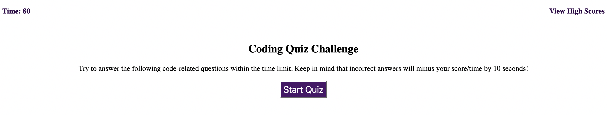
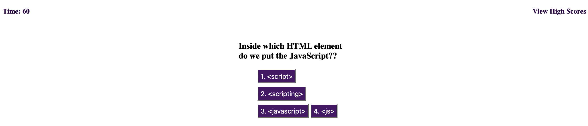
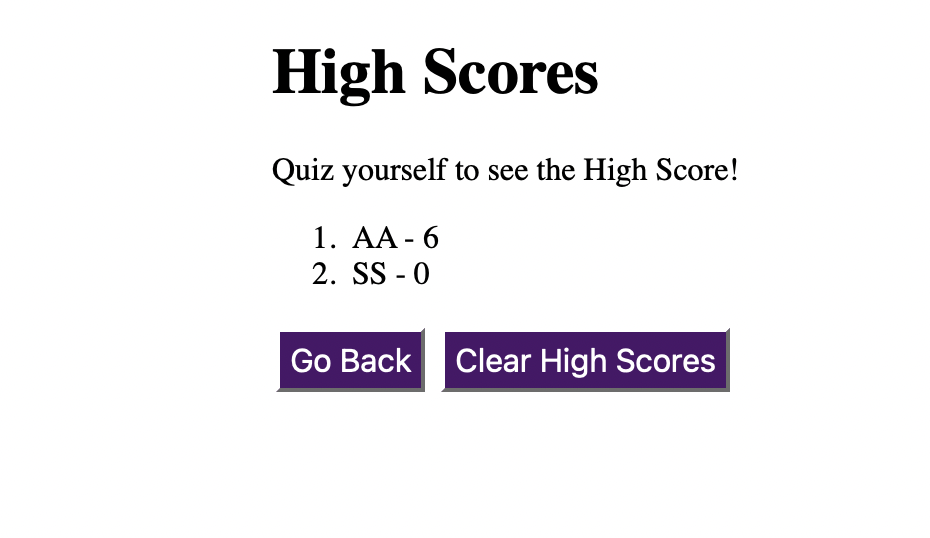
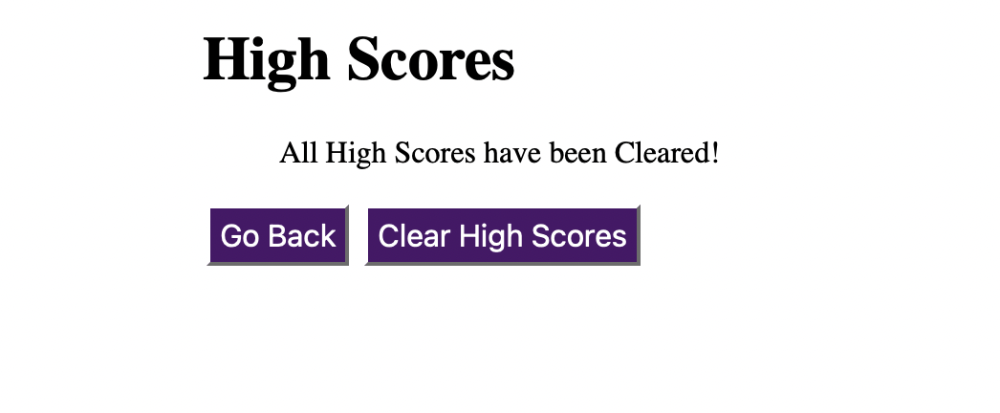

# Web APIs: Code Quiz

This app is a coding assessment, which is typically a combination of multiple-choice questions and interactive challenges. It has a timed code quiz that's made up of multiple-choice questions. This app will run in the browser and feature dynamically updated HTML and CSS powered by JavaScript code. It will also feature a clean and polished user interface and be responsive, ensuring that it adapts to multiple screen sizes.

## Authors

- [NoreenA](https://github.com/noori36)

## User Story

```
AS A student
I WANT to take a timed quiz on JavaScript fundamentals that stores high scores
SO THAT I can gauge my progress compared to my peers
```

## Development Criteria

```
GIVEN I am taking a code quiz
WHEN I click the Start button
THEN a timer starts and I am presented with a question
WHEN I answer a question
THEN I am presented with another question
WHEN I answer a question incorrectly
THEN time is subtracted from the clock
WHEN all questions are answered or the timer reaches 0
THEN the game is over
WHEN the game is over
THEN I can save my initials and score
```


### Link

[The URL of the functional, deployed application.](https://noori36.github.io/PasswordGenerator/)

[The URL of the GitHub repository.](https://github.com/noori36/PasswordGenerator)
 
## Deployment

Upload index.html and assets folder to the deployed webserver. The assets folder contains images, JS and CSS files.<br />

Once deployed the application can be viewed in a traditional desktop web browser. <br />

    
## Demo
<br>
<br>
<br>
<br>
<br>


## License

[MIT](https://choosealicense.com/licenses/mit/)


